# Комп’ютерний практикум No 1.

## ОСНОВИ РОБОТИ

## Мета роботи: 
ознайомитись із системою автоматизованого проєктування
; ознайомитись з меню та основними командами; створити власну
інтегровану бібліотеку та задати початкові налаштування програми.

##  Завдання на комп’ютерний практикум

1. Створити власну інтегровану бібліотеку.
2. Задати і зберегти початкові налаштування програми для використання у
наступних проєктах.
3. Налаштувати базові параметри компонентних модулів, які будуть
використовуватись у майбутніх проєктах.

## Хід роботи

1. Створимо проєкт

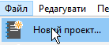

2. Відкриємо редактор символів

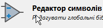

3. Створимо бібліотеку

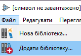

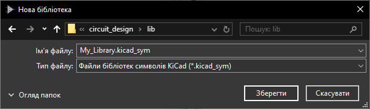

4. Створимо новий символ

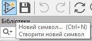

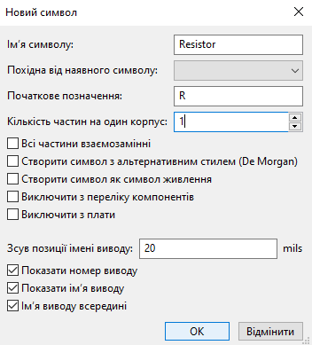

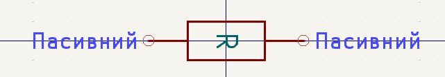

5. Створимо посадкове місце

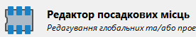

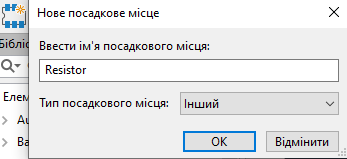

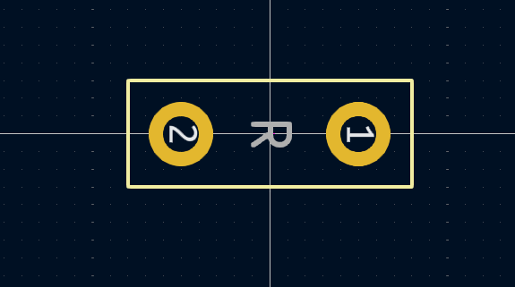

6. Під'єднаємо символ до посадкового місця

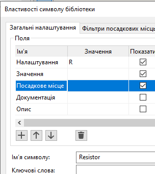

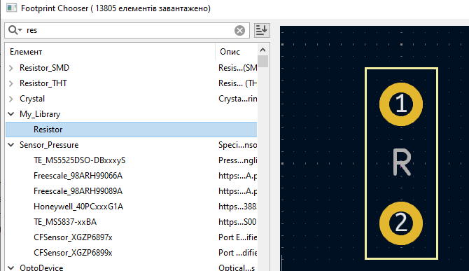

7. Протестуємо

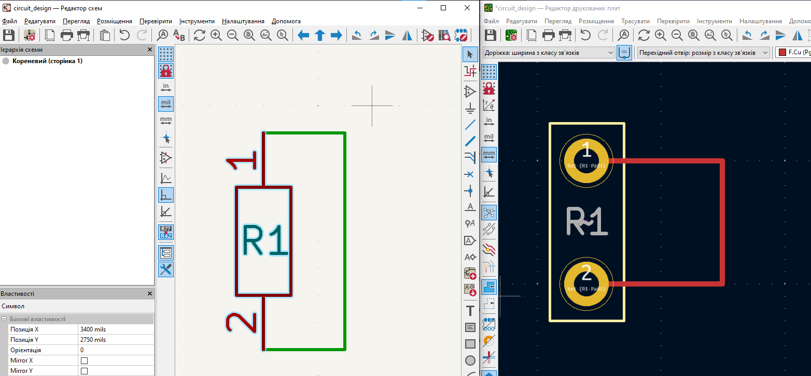

## Висновок

Незважаючи на використання KiCAD, практикум в Altium Designer показав, як налаштовувати глобальні та локальні параметри для оптимізації роботи. Ви дізналися, як змінювати сітку і товщину ліній для чіткішого проєктування. Оволодіння навичками персоналізації відображення та управління бібліотеками допомагає організувати компоненти та покращити процес проєктування. Важливість компіляції бібліотек та знання параметрів компонентів забезпечують точність і коректність проектів. Загалом, ці навички є основою для ефективної роботи в Altium Designer і успішного завершення електронних проектів.

## Питання для самоконтролю

1. **Налаштування глобальних параметрів Altium Designer:**
   - Відкрийте меню `Tools` (Інструменти) і виберіть `Preferences` (Налаштування).
   - У вікні `Preferences` ви зможете змінювати глобальні параметри, такі як шляхи до бібліотек, налаштування відображення та інші параметри, що впливають на всі проекти в Altium Designer.

2. **Зміна і налаштування сітки в Редакторі схем та Редакторі символів:**
   - У Редакторі схем або Редакторі символів, відкрийте меню `View` (Вигляд) і виберіть `Grid` (Сітка).
   - Тут можна змінювати параметри сітки, включаючи її розмір і тип (дюймова або метрична).
   - Ви також можете використовувати панель інструментів для налаштування сітки.

3. **Налаштування товщини ліній примітивів:**
   - У Редакторі схем або Редакторі символів, перейдіть до меню `View` (Вигляд) і виберіть `Line Width` (Товщина ліній).
   - Тут можна вибрати товщину ліній для примітивів.

4. **Зміна кольору фону:**
   - У Редакторі схем або Редакторі символів, відкрийте меню `View` (Вигляд) і виберіть `Background Color` (Колір фону).
   - Виберіть бажаний колір з палітри або вкажіть власний.

5. **Alpha Numeric Suffix:**
   - `Alpha Numeric Suffix` — це параметр, який дозволяє додавати алфавітно-цифрові суфікси до назв компонентів, щоб уникнути конфліктів між компонентами з однаковими назвами.

6. **Види бібліотек в Altium Designer:**
   - **Компонентні бібліотеки (Component Libraries)** — містять символи та посадкові місця для компонентів.
   - **Інтегровані бібліотеки (Integrated Libraries)** — бібліотеки, що містять як символи, так і посадкові місця в одному файлі.
   - **Проектні бібліотеки (Project Libraries)** — бібліотеки, які зберігаються в межах проекту.

7. **Створення власної бібліотеки:**
   - В Altium Designer відкрийте меню `File` (Файл) і виберіть `New` (Новий), потім `Library` (Бібліотека).
   - Виберіть тип бібліотеки (наприклад, `Component Library`).
   - Додайте компоненти до бібліотеки, налаштуйте символи та посадкові місця, а потім збережіть бібліотеку.

8. **Інтегрована бібліотека:**
   - Інтегрована бібліотека поєднує символи та посадкові місця в одному файлі, що спрощує управління бібліотекою та її використання в проектах.

9. **Компіляція бібліотеки:**
   - Компіляція бібліотеки необхідна для перевірки та оновлення бібліотеки, щоб усі елементи були правильно інтегровані і відображалися коректно в проекті.

10. **Основні системні атрибути компонентного модуля:**
    - **Назва компонента (Component Name)** — ідентифікатор компонента.
    - **Номер частини (Part Number)** — унікальний номер, що ідентифікує компонент.
    - **Опис (Description)** — текстовий опис компонента.
    - **Виробник (Manufacturer)** — інформація про виробника компонента.

11. **Створення користувацьких параметрів компонентного модуля:**
    - У Редакторі символів або посадкових місць виберіть компонент.
    - В меню `Properties` (Властивості) знайдіть секцію `Parameters` (Параметри).
    - Додайте нові параметри або змініть існуючі.

12. **Налаштування локальних параметрів Редактора плат або Редактора посадкових місць:**
    - Відкрийте меню `View` (Вигляд) і виберіть `Grid` (Сітка) для налаштування сітки.
    - Використовуйте меню `Tools` (Інструменти) і виберіть `Preferences` (Налаштування) для локальних налаштувань, таких як параметри відображення, кольори та інші опції, що впливають тільки на відкритий проект або документ.
