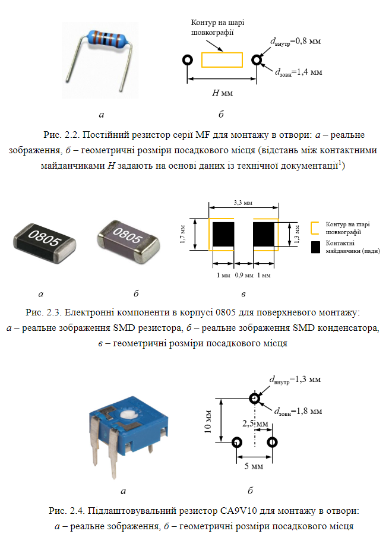
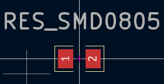

# Комп’ютерний практикум No 2.

РОЗРОБКА КОМПОНЕНТНИХ МОДУЛІВ ПАСИВНИХ 
ДИСКРЕТНИХ ЕЛЕКТРОННИХ КОМПОНЕНТІВ

## Мета роботи: 
створити умовні графічні позначення та посадкові місця 
різного  типу  для  резисторів,  конденсаторів  та  котушок  індуктивності; 
ознайомитись із типами корпусів пасивних дискретних електронних компонентів

##  Завдання на комп’ютерний практикуму
* Res MF 0.25 + RES_CONST_L10.0D0.8; 
* Res SMD0805 + RES_SMD0805; 
* Res CA9V10 + RES_VAR_CA9V10; 
* Res WH148 + RES_VAR_WH148; 
* Cap К10-17Б + CAP_CERAM_L5.0D0.8; 
* Cap Hitano ECR + CAP_POLAR_L2.5D0.8; 
* Cap SMD0805 + CAP_SMD0805; 
* Ind KIG + IND_L6.0D0.8. 

## Хід роботи

Створимо бібліотеку для виконання практикуму [Pr2 KiCAD LIbrary](../../../circuit_design/lib/Pr2)

### Символи

### Посадкові місця

## Висновок

У ході виконання комп’ютерного практикуму ми створили умовні графічні позначення та посадкові місця для різних типів пасивних дискретних електронних компонентів, зокрема резисторів, конденсаторів та котушок індуктивності, використовуючи програму KiCad. Під час роботи ми ознайомилися з різновидами корпусів для компонентів, зокрема для монтажу в отвори та поверхневого монтажу (SMD), а також навчилися створювати бібліотеки символів і посадкових місць.

Для кожного компонента ми розробили відповідне умовне графічне позначення (УГП) у редакторі символів, налаштувавши необхідні атрибути, нумерацію виводів та видимість полів. Після цього, в редакторі посадкових місць, створили моделі контактних майданчиків із врахуванням реальних геометричних розмірів компонентів та намалювали контури корпусів на шарі шовкографії.

Ми також навчилися правильно зв’язувати символи з посадковими місцями, що забезпечило коректне відображення компонентів на схемі та друкованій платі. Завдяки виконаній роботі ми отримали навички створення власних бібліотек для майбутніх проєктів, що дозволить нам ефективно працювати з новими електронними компонентами, не обмежуючись стандартними бібліотеками KiCad.

## Питання для самоконтролю 

1. **Що таке пасивні електронні компоненти?**

Пасивні електронні компоненти — це елементи електричних схем, які не мають власних джерел енергії. Вони можуть накопичувати енергію (наприклад, конденсатори та індуктивності) або розсіювати її (резистори).

2. **Опис деяких видів пасивних електронних компонентів та їх характеристики:**

- **Резистори**: чинять опір проходженню електричного струму, регулюють силу струму та напругу. Бувають постійні (незмінний опір) та змінні (регулювання опору в певних межах).
- **Конденсатори**: накопичують енергію електричного поля. Поширені види — керамічні (малі ємності) та електролітичні (великі ємності).
- **Котушки індуктивності**: накопичують енергію магнітного поля. Зазвичай мають високу індуктивність і малий активний опір.

3. **Опис УГП резисторів та вимоги до їх створення:**

Умовні графічні позначення (УГП) резисторів — це прямокутники або лінії, які зображують опір елемента на схемі. Вимоги:
- Лінії УГП мають бути розміром 8 мм по горизонталі.
- Довжина контактних виводів — 5 мм.
- Нумерація виводів повинна починатись з 1 для лівого виводу та 2 для правого.

4. **Відмінності між УГП постійного та змінного резистора:**

- УГП постійного резистора має лише два виводи та прямокутник між ними.
- УГП змінного резистора включає додатковий верхній вивід, стрілку для позначення рухомого контакту, що дозволяє змінювати опір.

5. **Що необхідно враховувати під час нумерації виводів на УГП змінного резистора?**

Необхідно враховувати положення середнього виводу, який з’єднаний із рухомим контактом. Вивід має бути правильно пронумерований відповідно до реального компонента, щоб забезпечити коректне підключення.

6. **Опис УГП конденсаторів та вимоги до їх створення:**

- УГП конденсаторів — дві паралельні лінії (постійний конденсатор) або одна суцільна і одна пунктирна лінія (полярний конденсатор).
- Вимоги: Довжина ліній — 8 мм, відстань між ними — 1,5 мм.
- Нумерація виводів: лівий — 1, правий — 2.

7. **Опис УГП котушок індуктивності та вимоги до їх створення:**
УГП котушки індуктивності складається з чотирьох півкіл, розташованих між двома виводами, довжина яких становить 5 мм. Півкола мають радіус 1,5 мм.

8. **Пояснення створення контуру елемента в Редакторі символів:**

Контур елемента малюється за допомогою інструментів **Place Line** або **Place Polygon**. Спочатку налаштовуються параметри сітки, щоб малюнок був точним, а потім за допомогою ліній або багатокутників створюється бажана форма символу.

9. **Як додати виводи елемента? Які властивості виводу можна налаштовувати у програмі?**

Виводи додаються за допомогою команди **Place Pin**. Під час додавання можна налаштувати:
- Номер виводу (Designator).
- Ім'я виводу (Name).
- Довжину виводу.
- Видимість параметрів виводу (Visible/Hidden).

10. **Атрибути електронного компонента, які можна редагувати:**

- Ім'я компонента.
- Позиційне позначення (Designator).
- Номінальні параметри (опір, ємність тощо).
- Тип компонента (пасивний/активний).
- Опис (Description) та коментар (Comment).

11. **Пояснення створення посадкових місць для електронного компонента:**

Посадкові місця створюються в **Footprint Editor**. Вибираються необхідні контактні майданчики (Pad), налаштовується їх діаметр, форма та відстань між ними. Після цього малюється контур компонента для позначення його положення на друкованій платі.

12. **Навіщо перший КМ деяких електронних компонентів для монтажу в отвори роблять прямокутним?**

Прямокутна форма першого контактного майданчика (КМ) дозволяє одразу визначити його на платі. Це допомагає правильно розмістити компонент під час монтажу та уникнути помилок із підключенням.

13. **Як об’єднати УГП електронного компонента та його ПМ?**

Після створення УГП у **Symbol Editor** додається модель посадкового місця (Footprint). У вікні властивостей компонента потрібно вибрати **Add Footprint** та обрати відповідну модель посадкового місця із бібліотеки.