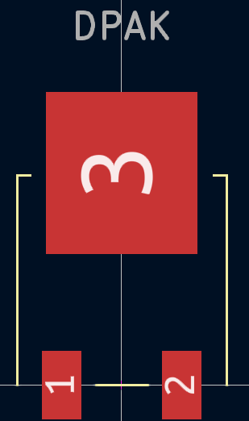

# Комп’ютерний практикум No 3.

РОЗРОБКА КОМПОНЕНТНИХ МОДУЛІВ АКТИВНИХ 
ДИСКРЕТНИХ ЕЛЕКТРОННИХ КОМПОНЕНТІВ

## Мета роботи: 

створити умовні графічні позначення та посадкові місця для 
діоду, біполярного та польового транзисторів; ознайомитись із типами корпусів 
активних дискретних електронних компонентів

##  Завдання на комп’ютерний практикуму

* діод 1N4001
* біполярні транзистори BC547  (Philips  Semiconductors) 
* BC557 (ON Semiconductors)
* JFET  транзистор  PMBFJ308 (Philips Semiconductors)
* MMBFJ176 (ON Semiconductors)
* MOSFET  транзистор 
* IRFR9310 (Vishay Siliconix)
* NTD24N06 (ON Semiconductors)
* BC547 , BC557 -> SOT5
* PMBFJ308 , MMBFJ176 -> SOT23-3,
* IRFR9310 , NTD24N06 -> DPAK

## Хід роботи

Створимо бібліотеку для виконання практикуму [Pr3 KiCAD LIbrary](../../../circuit_design/lib/Pr3)

### Символи

### Посадкові місця

## Висновок

У процесі виконання даного комп'ютерного практикуму ми створили умовні графічні позначення та посадкові місця для активних дискретних електронних компонентів, таких як діоди, біполярні та польові транзистори, використовуючи програмне забезпечення KiCad. Це дало змогу поглибити наші знання щодо структури та параметрів активних компонентів, а також навчитися правильно відтворювати їхні графічні символи на схемах.

Ми ознайомилися з особливостями різних типів корпусів для діодів та транзисторів, врахували їхню специфіку під час розробки посадкових місць у редакторі PCB. Для кожного компоненту були створені відповідні умовні графічні позначення в редакторі символів, де ми налаштували параметри виводів, позиційні позначення та типи з’єднань.

Особливу увагу було приділено правильній нумерації виводів, щоб забезпечити точність під час створення схеми та подальшого монтажу. Використання редактора посадкових місць дозволило створити моделі контактних майданчиків для SMD та крізьотвірних корпусів, а також розмістити на шарі шовкографії інформацію про контури компонентів та їхні основні характеристики.

У результаті роботи ми навчилися створювати власні бібліотеки активних дискретних компонентів, що дає можливість ефективно працювати над складними електронними проєктами, враховуючи специфіку кожного компонента та забезпечуючи високу точність створених схем та друкованих плат.

## Питання для самоконтролю 

1. Поясніть, що таке активні дискретні електронні компоненти.  

Активні дискретні електронні компоненти — це елементи, що здатні керувати потоком електричної енергії та мають властивість підсилення сигналу. До них належать діоди, транзистори (біполярні та польові) та інші напівпровідникові прилади. Вони використовують зовнішнє джерело енергії для зміни електричних характеристик.

2. Поясніть, які чинники необхідно враховувати при завданні нумерації виводів транзисторів та встановленні відповідності номерів виводів їх функціональному призначенню.

При нумерації виводів транзисторів необхідно враховувати тип транзистора (біполярний чи польовий) та його функціональні виводи (емітер, база, колектор для біполярних, або затвор, стік, витік для польових). Номери виводів мають відповідати їхньому призначенню, що вказане в технічній документації на компонент. Важливо враховувати стандарт розташування виводів у корпусі, щоб уникнути помилок при розміщенні на платі.

3. Яким чином за УГП діода визначити, у якому напрямку він пропускає струм? 

УГП діода зображується у вигляді стрілки, яка показує напрямок струму від анода до катода. Стрілка вказує, в якому напрямку діод пропускає струм: від анода (кінця без горизонтальної лінії) до катода (кінець зі смужкою, що символізує бар'єр).

4. Яким чином за корпусом діода визначити, де катод, а де – анод?

Катод діода часто позначений маркером у вигляді смужки або виїмки на корпусі компонента. Ця смужка відповідає лінії на умовному графічному позначенні діода. Інший вивід діода, який не має маркерів, є анодом.

5. Поясніть, яким чином створити контур КМ не круглої форми, а, наприклад, овальної. 

Для створення овальної форми контактного майданчика (КМ) у редакторі посадкових місць (Footprint Editor) необхідно відкрити вікно налаштувань Pad і обрати параметр "Shape" (Форма). В цьому параметрі вибираємо "Oval" або "Rectangle" із заокругленими кутами. Також можна налаштувати розміри майданчика за параметрами X-Size (довжина) та Y-Size (ширина).

6. Опишіть процес розробки ПМ для електронного компоненту у корпусі SOT23-3.  

Створення ПМ для компоненту в корпусі SOT23-3 передбачає:
- Встановлення трьох контактних майданчиків (Pad) згідно з технічними характеристиками: два виводи зліва та один праворуч.
- Налаштування розмірів контактних майданчиків: внутрішній діаметр та зовнішній діаметр для отворів.
- Малювання контуру компонента на шарі шовкографії (Top Overlay) у вигляді прямокутника, враховуючи відстані між контактами.

7. Поясніть, яким чином об’єднати УГП та ПМ на прикладі одного із транзисторів. 

Для об'єднання УГП та ПМ транзистора необхідно:
- Відкрити символ транзистора у **Symbol Editor**.
- Додати модель посадкового місця (Footprint) за допомогою команди **Add Footprint** у властивостях символу.
- Вибрати відповідну модель посадкового місця з бібліотеки або вручну вказати шлях до неї.
- Перевірити відповідність нумерації виводів символу та контактних майданчиків у вікні **Pin Mapping**.
- Після цього символ буде пов'язаний із посадковим місцем, і під час розміщення його на схемі автоматично відобразиться відповідне ПМ на платі.