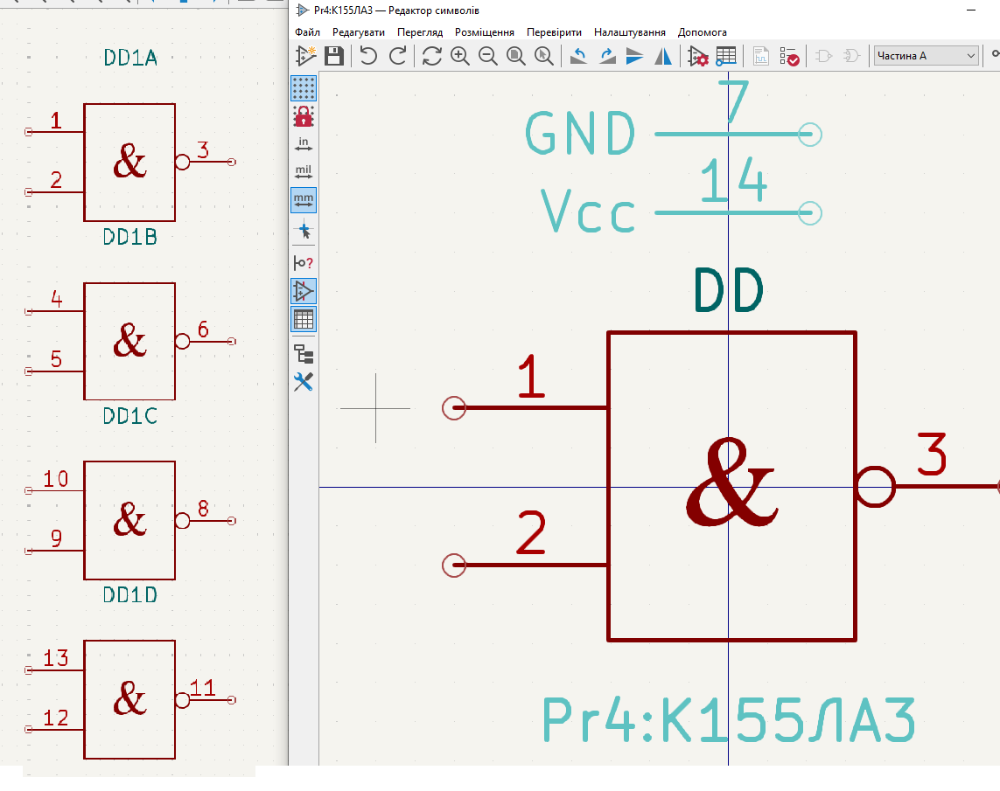

# Комп’ютерний практикум No 4

РОЗРОБКА КОМПОНЕНТНОГО МОДУЛЯ ЦИФРОВОЇ
МІКРОСХЕМИ К155ЛА3

## Мета роботи: 

ознайомитись з конструкцією та призначенням мікросхеми
К155ЛА3; створити умовне графічне позначення структурного елементу
мікросхеми К155ЛА3, яким є логічний елемент І-НЕ; розробити посадкове місце
для мікросхеми К155ЛА3

## Теоретичні відомості

##  Завдання на комп’ютерний практикуму

## Хід роботи

Рохробити символ та поспдкове місце для мікросхеми К155ЛА3.

[Було розроблено бібліотеку для мікросхеми](../../../circuit_design/lib/Pr4)

### Символ

### Посадкове місце

### Висновок

Під час виконання цієї роботи я ознайомився з мікросхемою К155ЛА3, яка є радянським аналогом SN7400 і містить чотири логічних елементи І-НЕ. Я створив умовне графічне позначення для одного елемента І-НЕ, розробив посадкове місце для мікросхеми К155ЛА3 у корпусі DIP та об’єднав ці елементи у завершений компонентний модуль.

### Аитання самоконтролю

1. Поясніть логічну функцію, яку виконує елемент 2І-НЕ.  
   Елемент 2І-НЕ реалізує логічну функцію І-НЕ (NAND), яка видає логічну "0" тільки тоді, коли на обох входах присутні логічні "1". В іншому випадку на виході буде логічна "1".

2. Що таке транзисторно-транзисторна логіка?  
   Транзисторно-транзисторна логіка (ТТЛ) — це тип цифрових логічних схем, побудованих на основі біполярних транзисторів та резисторів, який забезпечує високі швидкості роботи та стабільність.

3. Опишіть характеристики мікросхеми К155ЛА3.  
   Мікросхема К155ЛА3 містить чотири логічних елементи І-НЕ з двома входами, виготовлених за технологією ТТЛ. Живлення подається через виводи GND (вивід 7) та Vcc (вивід 14), а інші виводи є входами та виходами ТТЛ-елементів.

4. Яким чином формується позначення ланцюгів живлення мікросхем?  
   Ланцюги живлення можуть позначатися різними способами, такими як V+, +V, Vcc тощо. Головна умова полягає у зрозумілості позначень для розробника схеми та інших осіб, які працюватимуть з цією схемою.

5. Яким чином додаються до УГП компонента виводи живлення та землі?  
   Виводи живлення та землі додаються до УГП компонента аналогічно до інших виводів, але їх можна приховати, змінюючи властивості у полі Connect To, та налаштувавши їх підключення до відповідних ланцюгів.

6. Опишіть процес створення посадкового місця мікросхеми К155ЛА3.  
   Посадкове місце створюється за допомогою бібліотеки посадкових місць у Altium Designer, де налаштовуються геометричні параметри, такі як форма, розмір та розташування контактних майданчиків (КМ) згідно з характеристиками корпусу мікросхеми.

7. Яким чином створюється найпростіша тривимірна модель корпусу мікросхеми засобами Altium Designer?  
   Тривимірна модель створюється за допомогою додавання об’єкту 3D Body у бібліотеці компонентів, де налаштовується форма моделі (наприклад, прямокутний паралелепіпед), висота, зазор та інші параметри.

8. З яких міркувань і яким чином обирається механічний шар для розміщення тривимірної моделі корпусу мікросхеми?  
   Механічний шар обирається з урахуванням того, що на ньому не повинно міститися жодних інших графічних примітивів. Зазвичай використовується шар, де розміщуються моделі компонентів із стандартної бібліотеки, наприклад, Mechanical 13.

9. Яким чином виконується перевірка розробленого компоненту на наявність помилок?  
   Перевірка виконується за допомогою команди Reports → Component Rule Check, яка фіксує найпростіші помилки, такі як дубльовані виводи, помилки атрибутів тощо.
