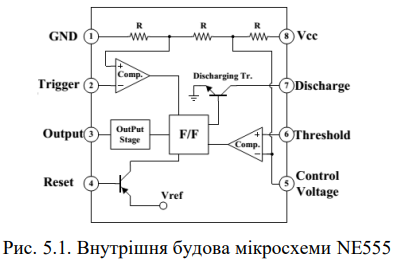
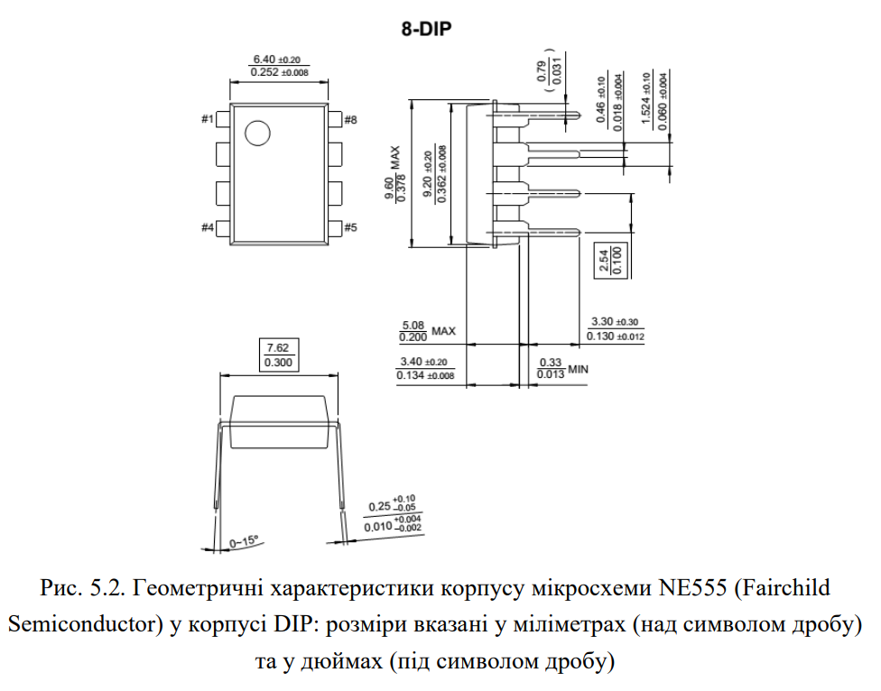
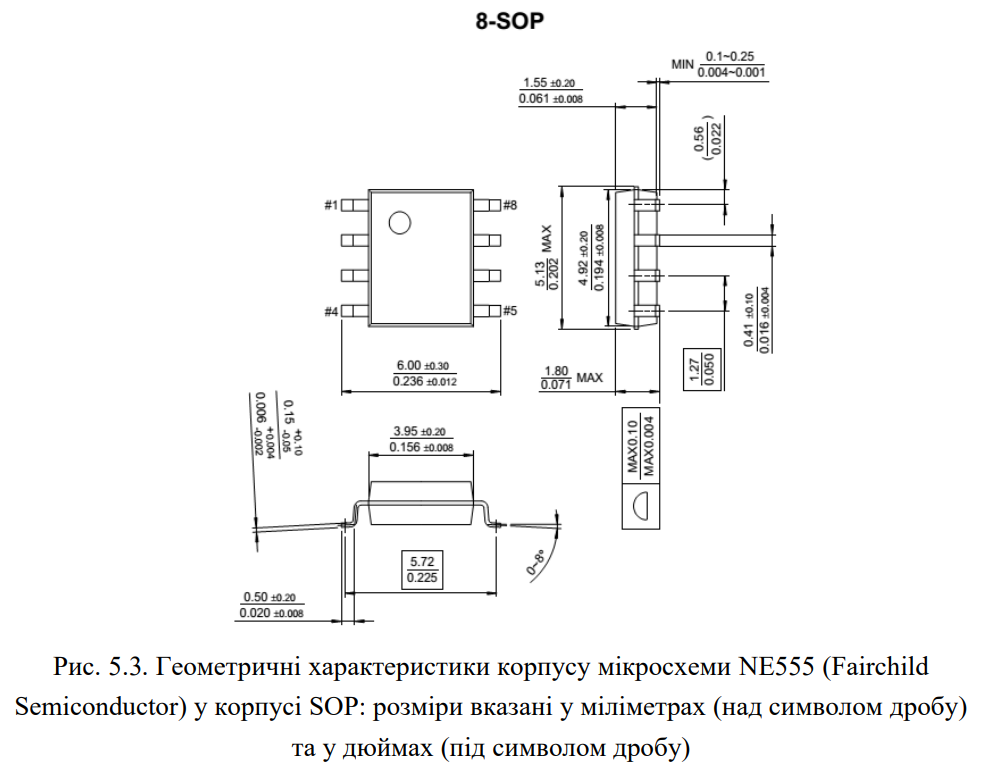
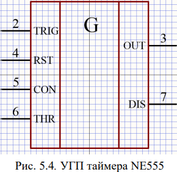
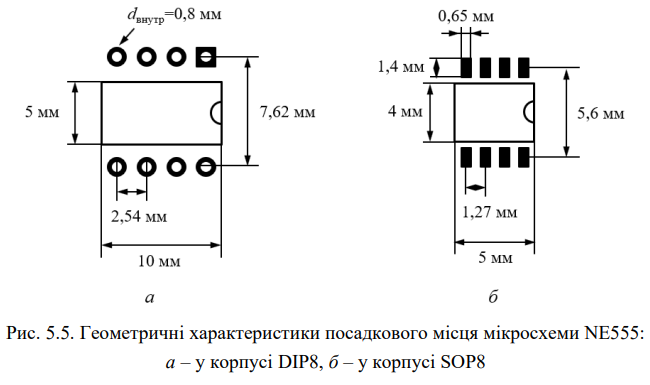
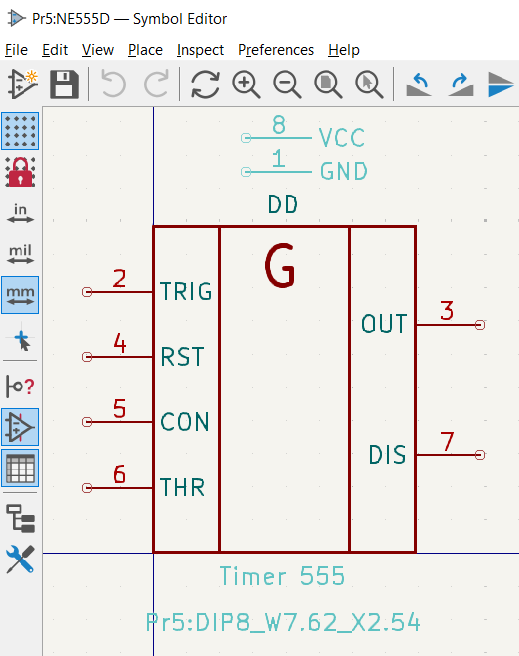
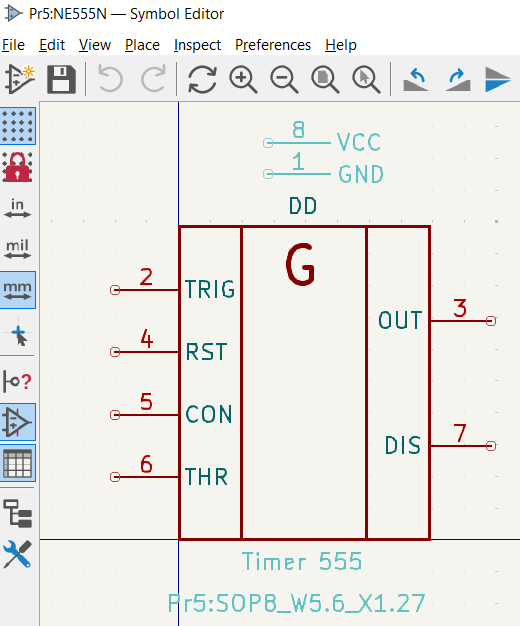
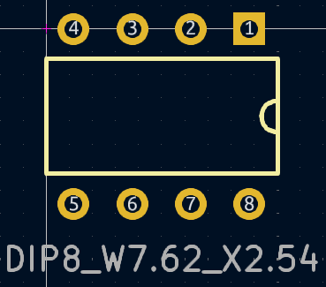
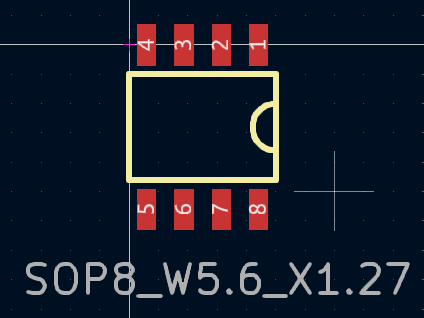
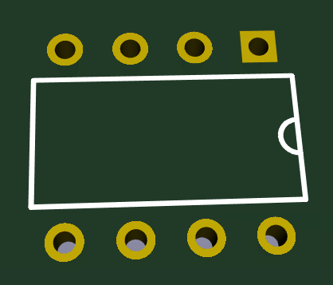

# Комп’ютерний практикум No 5

РОЗРОБКА КОМПОНЕНТНОГО МОДУЛЯ ТАЙМЕРА 555

## Мета роботи: 

ознайомитись з конструкцією та призначенням мікросхеми
таймера 555; створити умовне графічне позначення та посадкове місце для
таймера 555.

## Теоретичні відомості

|  |  |
|---|---|

##  Завдання на комп’ютерний практикуму

|  |  |
|---|---|

## Хід роботи

Розробити символ та посадкове місце для мікросхеми 555.

[Було розроблено бібліотеку для мікросхеми](../../../circuit_design/lib/Pr5)

### Символ

|  |  |
|---|---|

### Посадкове місце

|  |  |
|---|---|

### 3Д вигляди

|  |  |
|---|---|

### Висновок

Під час виконання роботи я ознайомився з конструкцією та призначенням мікросхеми таймера 555. Я створив умовне графічне позначення (УГП) і посадкове місце (ПМ) для таймера NE555 в корпусах DIP і SOP. В результаті роботи я об'єднав УГП та ПМ у завершені бібліотечні компонентні модулі, які можуть бути використані в подальших проектах. 

### Питання самоконтролю

1. Призначення таймера 555:

Таймер 555 призначений для формування одиночних та повторюваних імпульсів зі стабільними часовими характеристиками. Його використовують для побудови генераторів, модуляторів, реле часу та інших пристроїв.

2. Принцип роботи таймера 555:

Принцип роботи базується на зарядці та розрядці конденсатора, яка визначає тривалість імпульсів. Він може працювати в двох режимах: моностабільному (одноразовий імпульс) або астабільному (періодичні імпульси).

3. Приклади застосування: 

Таймер 555 використовують у різних електронних пристроях, таких як генератори частоти, таймери з відкладеним увімкненням, широтно-імпульсні модулятори та сигналізатори.

4. Тип корпусу SOP: 

Корпус SOP (Small Outline Package) — це поверхнево-монтований тип корпусу з «крильцями» (Gullwing leads), який використовують для компактних електронних пристроїв.

5. Тип корпусу DIP: 

DIP (Dual In-line Package) — корпус із двома рядами виводів, який призначений для монтажу через отвори на платі.

6. Процес створення ПМ за допомогою Pattern Wizard: 

Pattern Wizard — це майстер, який допомагає автоматично створювати посадкові місця компонентів за заданими геометричними параметрами.

7. Майстер IPC Compliant Footprint Wizard: 

Цей майстер використовується для створення ПМ за стандартами IPC. Він генерує посадкове місце на основі параметрів компонентів і вимог IPC.

8. Процес створення ПМ за допомогою IPC Compliant Footprint Wizard: 

В процесі створення вказують точні розміри корпусу і контактних майданчиків, на основі яких майстер автоматично генерує посадкове місце.

9. Відмінності між Pattern Wizard та IPC Compliant Footprint Wizard: 

Pattern Wizard створює ПМ на основі геометричних параметрів, тоді як IPC Compliant Footprint Wizard працює відповідно до стандартів IPC і враховує додаткові параметри, такі як форма паяльного з’єднання.
