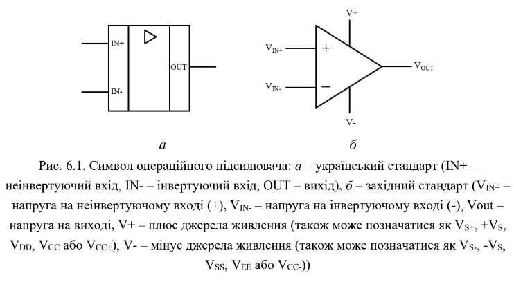
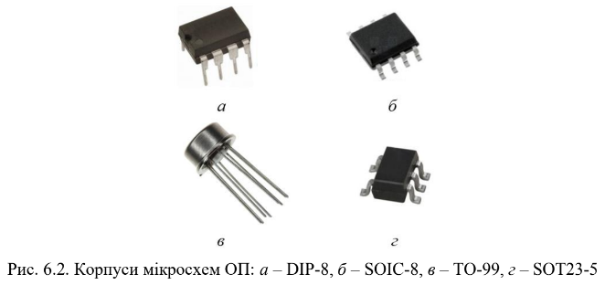
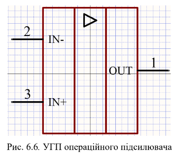
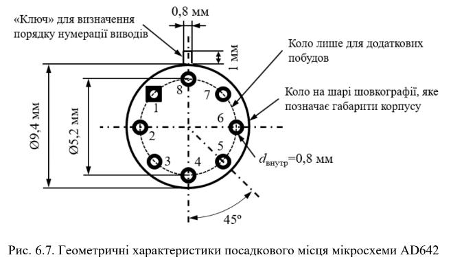
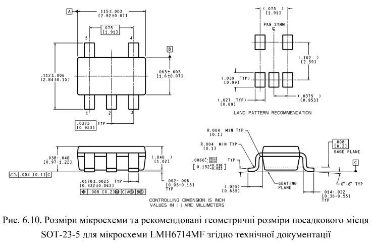
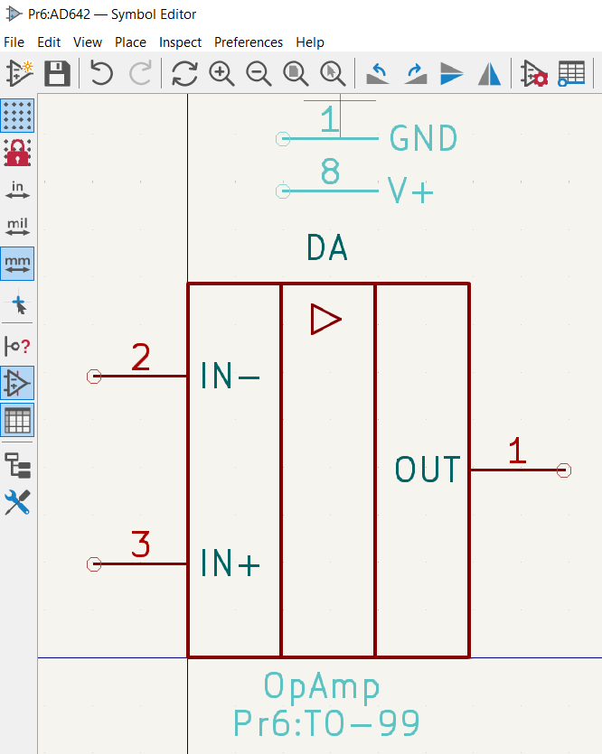
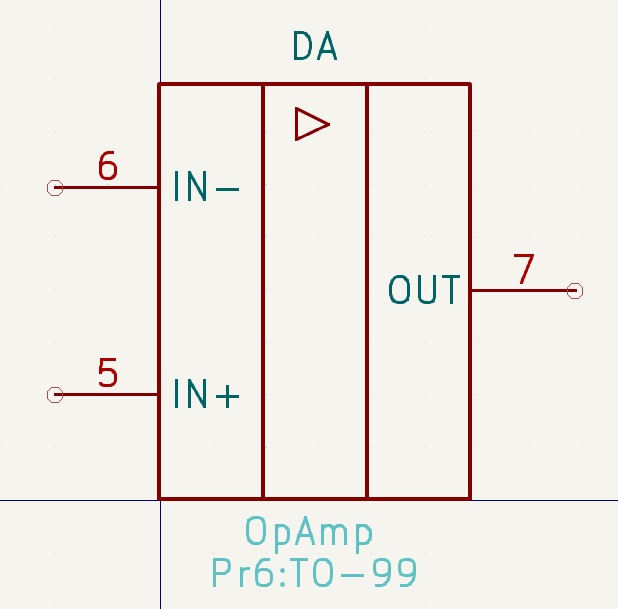
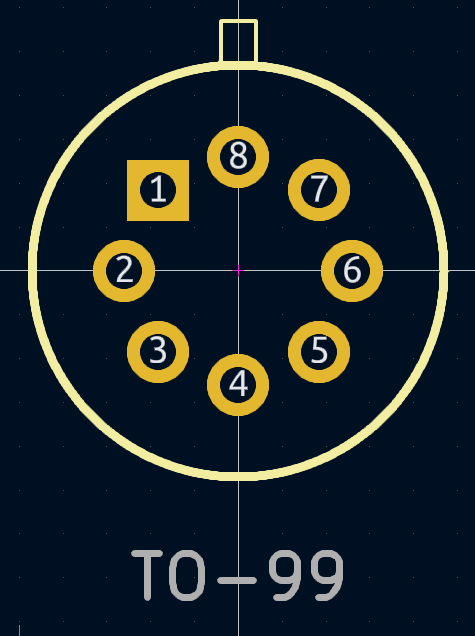
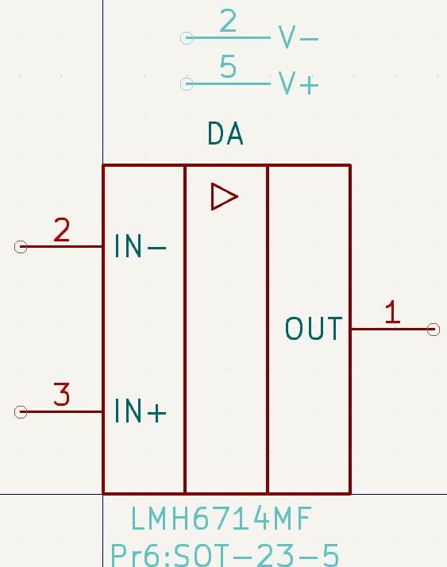
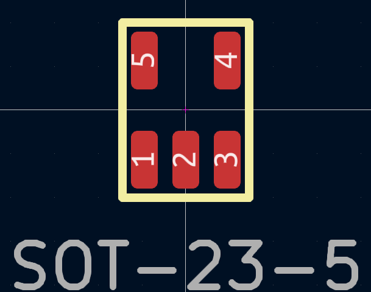

# Комп’ютерний практикум No 6

РОЗРОБКА КОМПОНЕНТНИХ МОДУЛІВ ОПЕРАЦІЙНИХ
ПІДСИЛЮВАЧІВ LMH6714MF ТА AD642

## Мета роботи: 

ознайомитись з теорією операційних підсилювачів; створити
умовне графічне позначення операційного підсилювача; ознайомитись з
конструкцією та призначенням мікросхем операційних підсилювачів LMH6714MF
та AD642; створити посадкові місця для зазначених мікросхем.

## Теоретичні відомості

##  Завдання на комп’ютерний практикуму

|  |  |
|---|---|

## Хід роботи

[Було розроблено бібліотеку для мікросхем](../../../circuit_design/lib/Pr6)

#### AD642 - TO-99

|  |  |   |
|---|---|---|

#### LMH6714MF - SOT-23-5

|  |  |
|---|---|

### Висновок

У рамках комп’ютерного практикуму №6 я ознайомився з основними теоретичними відомостями про операційні підсилювачі (ОП), їхню будову, функції та особливості мікросхем LMH6714MF та AD642. Також я створив умовне графічне позначення цих мікросхем та розробив посадкові місця для них. Операційні підсилювачі використовуються в багатьох схемах для побудови пристроїв з високою точністю, таких як масштабувальні підсилювачі, генератори сигналів та стабілізатори.

### Питання самоконтролю

1. Операційний підсилювач – це електронний підсилювач напруги з високим коефіцієнтом підсилення, що має два входи (інвертуючий і неінвертуючий) і один вихід. Він використовується для побудови схем з точно визначеною передавальною функцією, яка контролюється ланцюгом зворотного зв’язку.

2. Зворотний зв'язок в операційних підсилювачах – це процес, коли частина вихідного сигналу повертається на вхід підсилювача для контролю його поведінки. Є два типи зворотного зв’язку: 
   - *Негативний зворотний зв'язок* – зменшує підсилення, але покращує стабільність і лінійність системи.
   - *Позитивний зворотний зв'язок* – збільшує підсилення і може використовуватися для створення генераторів сигналів або схем з пороговим режимом роботи.

3. Мета використання зворотного зв’язку в підсилювачах полягає в тому, щоб покращити стабільність, зменшити спотворення, контролювати підсилення та розширити частотний діапазон.

4. На основі операційних підсилювачів можна побудувати різні схеми, такі як:
   - Прецизійні масштабувальні підсилювачі
   - Генератори сигналів і функцій
   - Стабілізатори напруги і струму
   - Активні частотні фільтри
   - Логарифмувальні підсилювачі
   - Інтегратори та диференціатори

5. Операційні підсилювачі випускаються в різних корпусах, зокрема:
   - *DIP-8* (dual in-line package)
   - *SOIC-8* (small-outline integrated circuit)
   - *TO-99* (металевий корпус)
   - *SOT23-5* (малий пластиковий корпус)

6. Процес розробки посадкового місця для AD642 включає кілька етапів:
   - Аналіз технічної документації для мікросхеми, щоб визначити її фізичні розміри і конфігурацію виводів.
   - Створення графічного позначення мікросхеми у спеціалізованому програмному забезпеченні для проектування схем.
   - Розробка посадкового місця з урахуванням розмірів контактних майданчиків для припою і відстані між ними.
   - Перевірка відповідності вимогам електронної схеми та створення фінального макету посадкового місця.