# Комп’ютерний практикум No 7

РОЗРОБКА КОМПОНЕНТНИХ МОДУЛІВ З’ЄДНУВАЧІВ ТА
РОЗ’ЄМІВ

## Мета роботи: 

ознайомитись з різними типами з’єднувачів та роз’ємів;
створити УГП та посадкові місця роз’ємів PLS, BNC, DS-210 та клеми KF301-2P.

## Теоретичні відомості

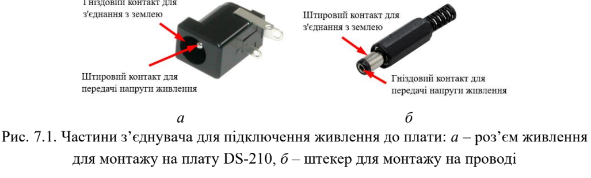

| 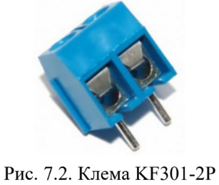 | 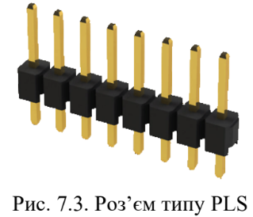 | 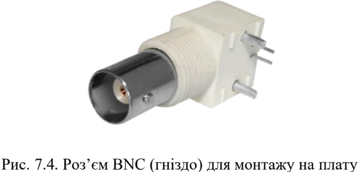 |
|---|---|---|

<!-- 
|  |  |
|---|---| 
-->

##  Завдання на комп’ютерний практикум

* PLS-2
* BNC-7044
* KF301-2P
* DS-210

| 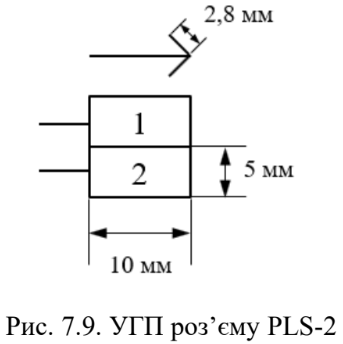 | 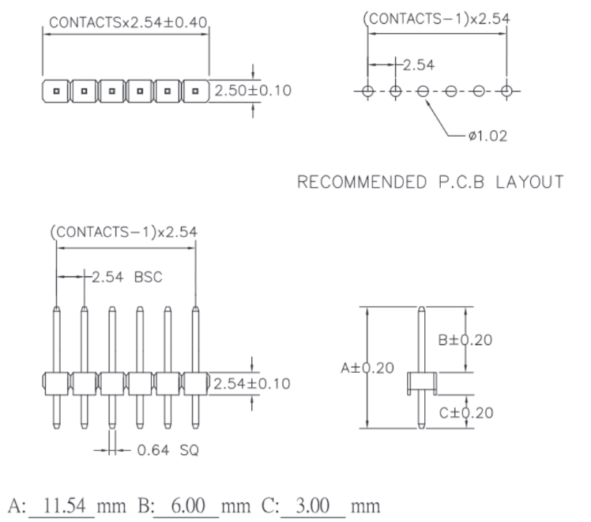 |
|---|---|

| 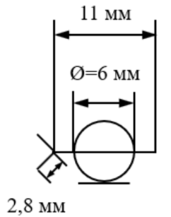 | 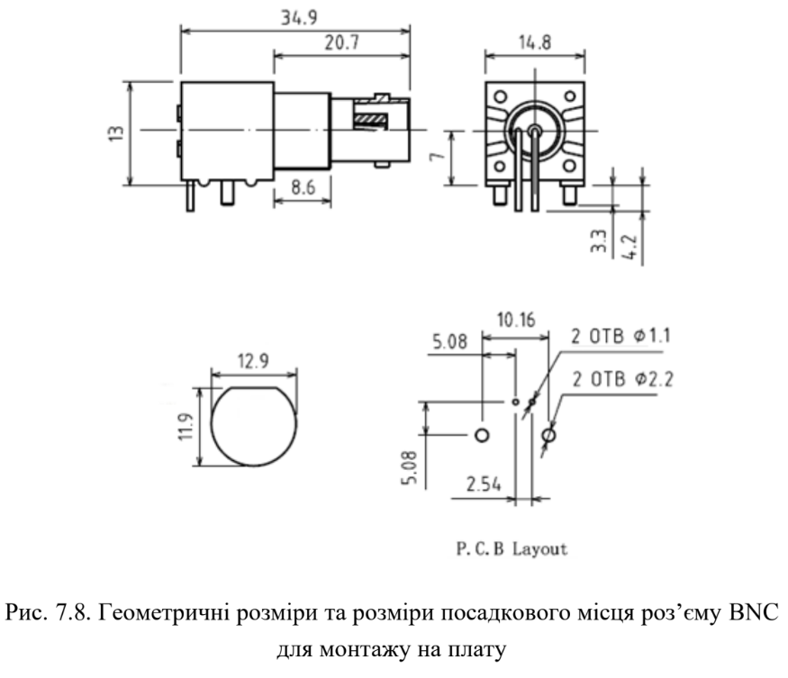 |
|---|---|

| 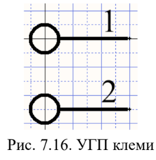 | 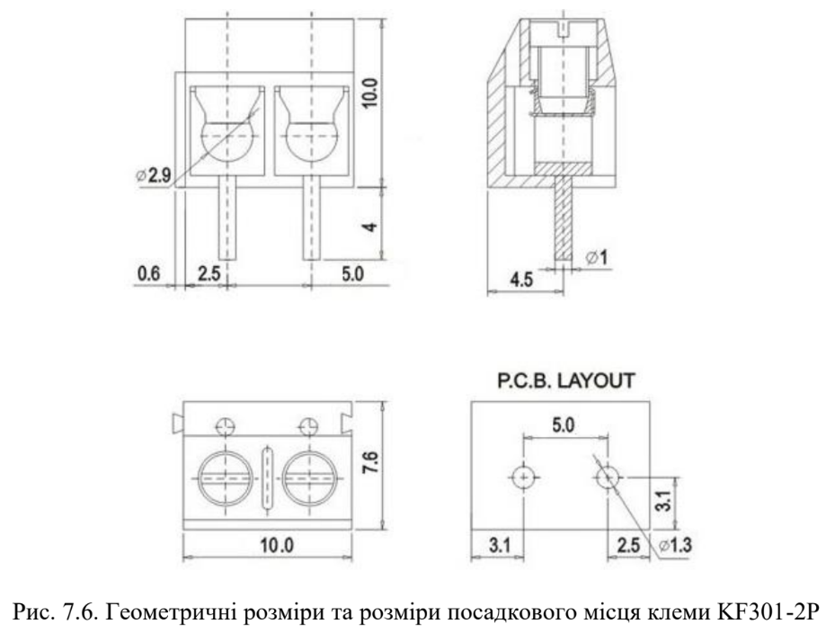 |
|---|---|

| 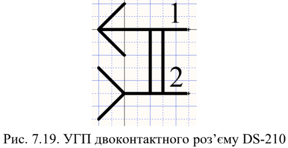 | 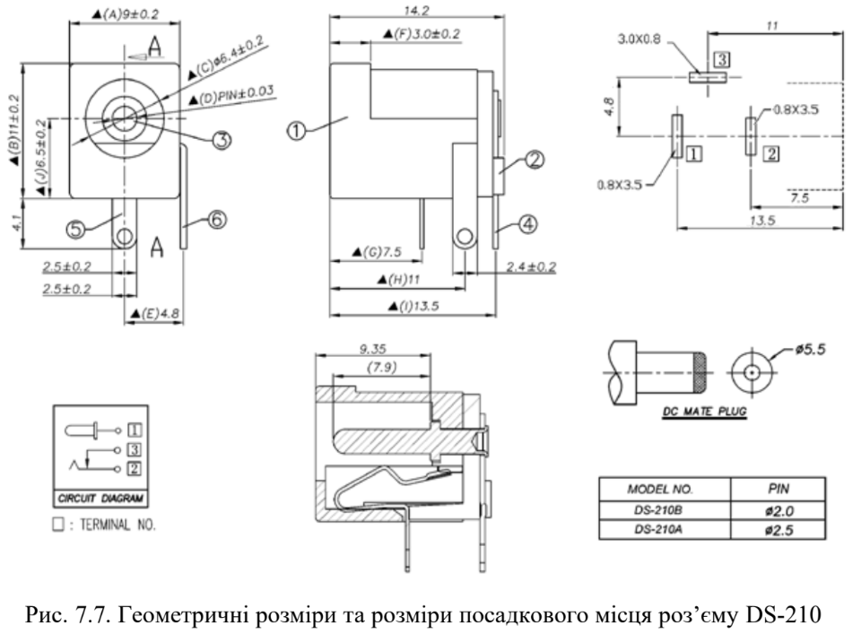 |
|---|---|

## Хід роботи

### PLS-2

| 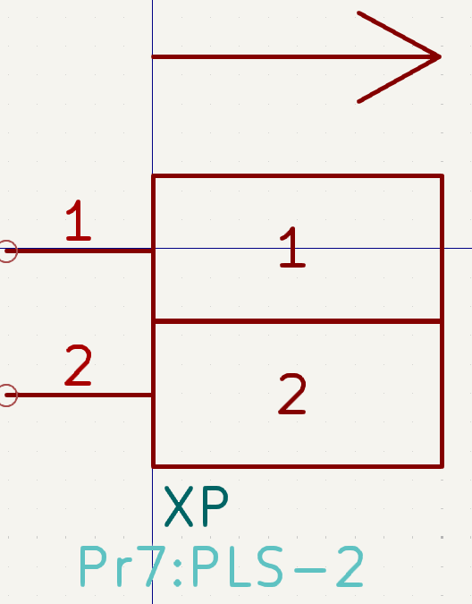 | 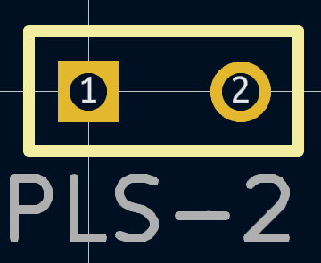 |
|---|---|

### PLS-4

| 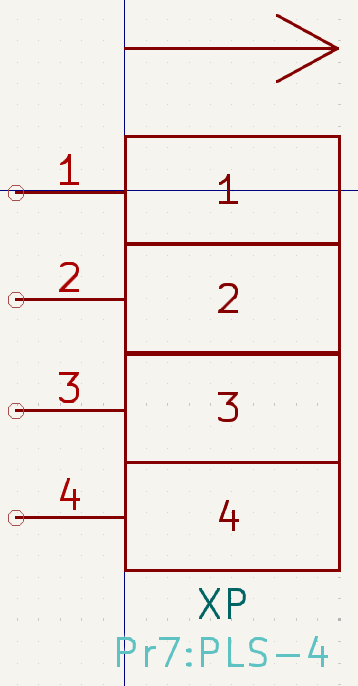 | 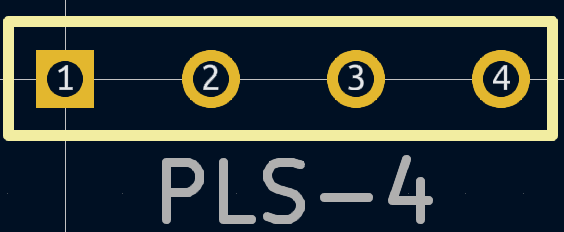 |
|---|---|

### BNC-7044

| 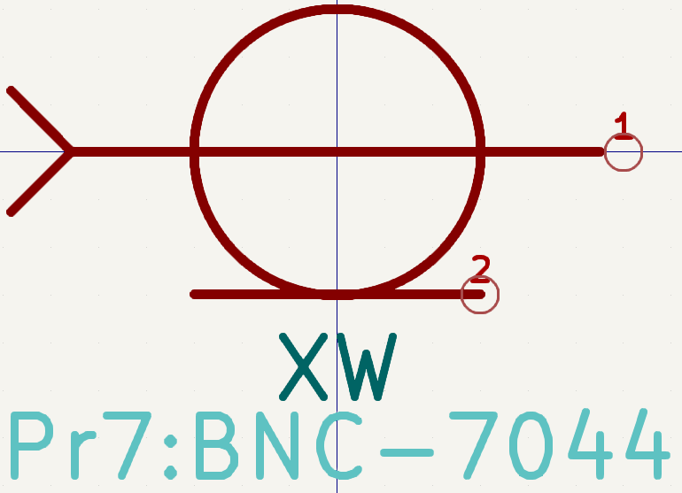 | 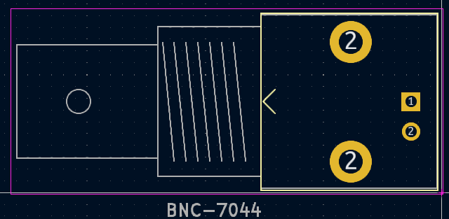 |
|---|---|

### KF301-2P

| 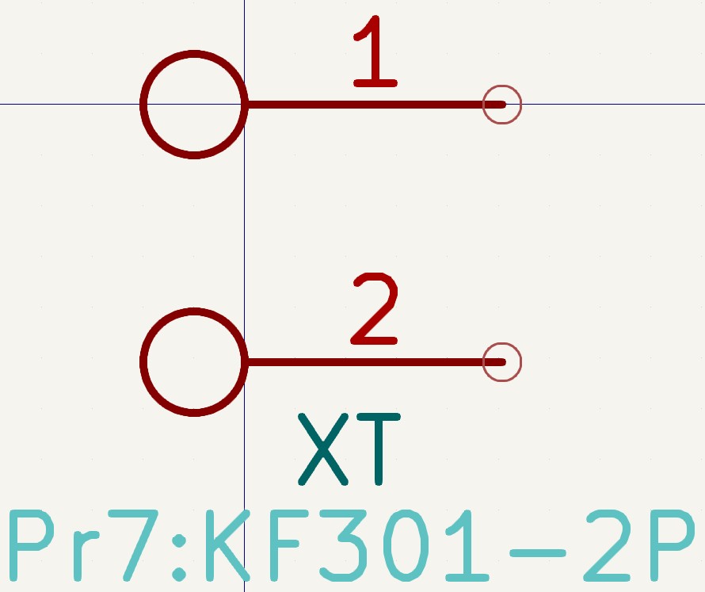 | 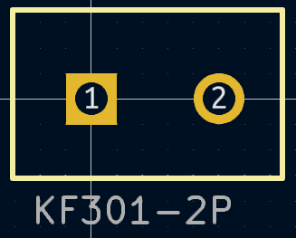 |
|---|---|

### DS-210

| 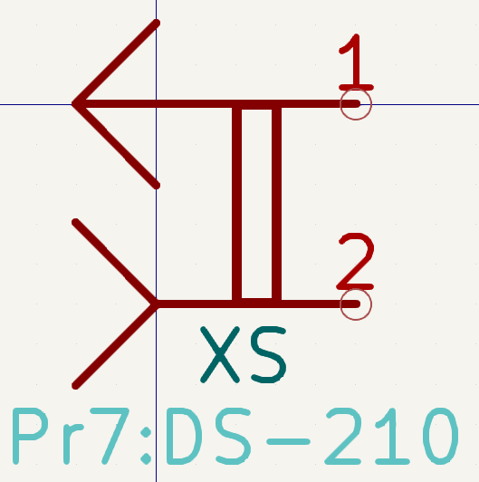 | 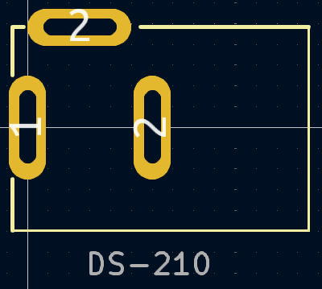 |
|---|---|

### Висновок

Метою сьомого комп’ютерного практикуму було ознайомитися з різними типами з’єднувачів та роз’ємів, а також створити універсальні графічні представлення (УГП) та посадкові місця для роз’ємів PLS, BNC, DS-210 і клем KF301-2P. 

Я детально вивчив різні типи з’єднувачів, їх конструкції та функціональні особливості. Це дозволило мені краще зрозуміти, як правильно підключати зовнішні джерела живлення та інші електронні компоненти, використовуючи роз’єми та з’єднувачі. Потім, застосовуючи отримані знання, я створив УГП та відповідні посадкові місця для роз’ємів, які були зазначені у завданні.

Робота допомогла мені краще зрозуміти процес вибору та використання з’єднувачів для проектування електронних схем, а також отримати практичні навички у розробці таких компонентів в CAD-системах.

### Питання самоконтролю

Ось відповіді на запитання самоконтролю:

1. Для чого призначені роз’єми і з’єднувачі?
   Роз’єми та з’єднувачі призначені для механічного з’єднання та роз’єднання електричних провідників, забезпечуючи передачу електричних сигналів або живлення між пристроями.

2. Якими бувають контактні елементи роз’ємів?
   Контактні елементи роз’ємів бувають двох типів: штирові (male contact), які забезпечують контакт на зовнішній поверхні, та гніздові (female contact), що забезпечують контакт на внутрішній поверхні.

3. Чим вилка відрізняється від розетки?
   Вилка (plug) – це частина з’єднувача, яка приєднується до кабелю, тоді як розетка (socket) – це частина, яка монтується на плату або інший конструктивний елемент. Вилка зазвичай більш рухома, а розетка – менш рухома.

4. Деякі відомі типи роз’ємів і з’єднувачів:
   - DS-210: Гібридний роз’єм для живлення, який має як штировий, так і гніздовий контактний елемент.
   - BNC: Роз’єм із байонетною фіксацією, що використовується для передачі високочастотних сигналів через коаксіальний кабель.
   - PLS: Штировий роз’єм для монтажу на плату, що може бути розділений на кілька контактів.
   - KF301-2P: Клема для підключення проводів, яка може бути з’єднана з іншими для утворення довгої колодки.

5. Що таке багатоконтактні роз’єми?
   Багатоконтактні роз’єми – це роз’єми, які мають кілька контактних елементів (від 2 і більше) для одночасної комутації кількох електричних ланцюгів.

6. Як розробляються УГП багатоконтактних роз’ємів?
   Розробка УГП багатоконтактних роз’ємів включає створення графічного представлення кожного контакту в CAD-системі, а також забезпечення правильного розташування та нумерації контактів для правильного з’єднання.

7. Процес розробки компонентного модуля роз’єму DS-210:
   Спочатку створюється графічне представлення роз’єму, зокрема його штирових та гніздових контактів. Далі визначаються посадкові місця для пайки контактів, а також фіксуються відповідні геометричні параметри.

8. Процес розробки компонентного модуля роз’єму BNC:
   Графічне представлення BNC включає корпус роз’єму, місця для монтажу на платі, а також контактний елемент для підключення коаксіального кабелю. Важливо передбачити кріплення гайкою до корпусу.

9. Процес розробки компонентного модуля клеми KF301-2P:
   Клема має посадкові місця для двох проводів. Її модуль включає графічне представлення затискачів і монтажних отворів для установки на платі. Також слід врахувати можливість з'єднання кількох клем в одну колодку.

10. Процес розробки компонентного модуля роз’єму PLS:
    Створюється графічне представлення штирової лінійки PLS з врахуванням кількості контактів. Модуль має передбачати можливість розділення лінійки на менші частини.

11. Як створити форму КМ, яка відрізняється від круглої або прямокутної?
    Для створення нетипової форми КМ (компонентного модуля) в CAD-системі необхідно використати функції обробки контурів, дозволяючи модифікувати стандартні фігури та адаптувати їх під специфічні вимоги.

12. Чи можуть бути у посадковому місці два контактних майданчики з однаковими номерами?
    Ні, у посадковому місці не може бути два контактних майданчики з однаковими номерами, оскільки це призведе до плутанини в схемі та неправильного підключення. Кожен контакт має бути унікально пронумерований.
