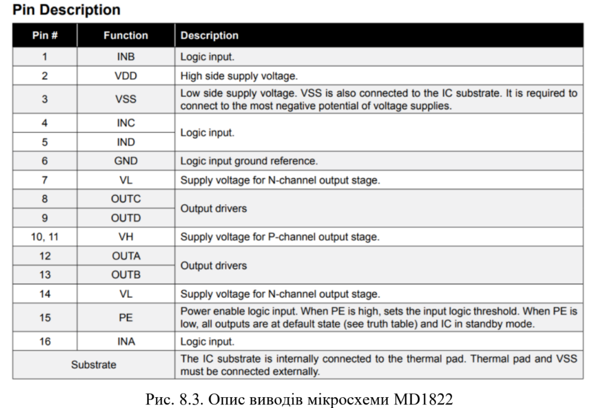
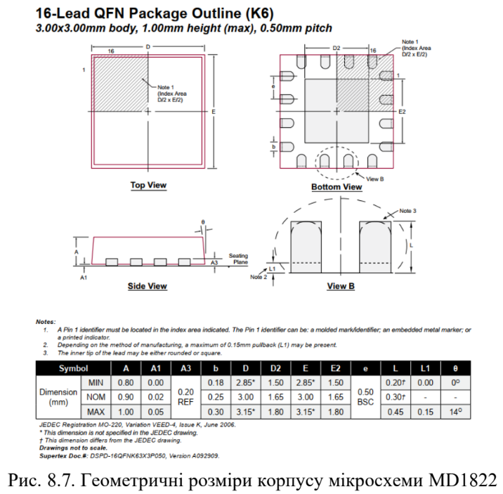
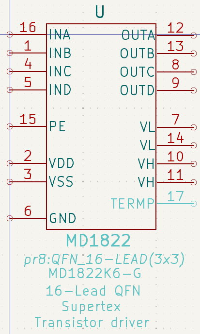
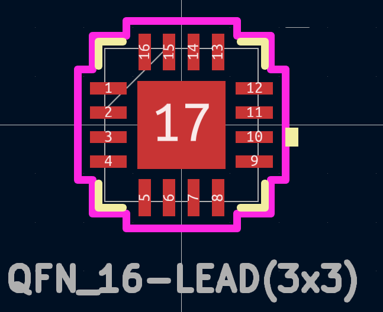

# Комп’ютерний практикум No 8.

РОЗРОБКА КОМПОНЕНТНОГО МОДУЛЯ ДРАЙВЕРА
СИЛОВИХ ТРАНЗИСТОРІВ MD1822

## Мета роботи: 

ознайомитись із принципами роботи та областями
застосування драйверів транзисторів; створити умовне графічне позначення
драйвера транзистора із використанням міжнародних стандартів; побудувати
посадкове місця для мікросхеми MD1822.

## Теоретичні відомості

|  |  |
|---|---| 

## Хід роботи

[Було розроблено бібліотеку для мікросхеми](../../../circuit_design/lib/Pr8)

|  |  |
|---|---| 

### Висновок

### Питання самоконтролю

1. Поясніть, що таке драйвер транзистору? Для чого він призначений?
2. Поясніть, яким чином змінити властивості групи контактів?
3. Поясніть, як розробити УГП драйвера транзистора MD1822?
4. Поясніть, яким чином створити посадкове місце для мікросхеми у корпусі
QFN?
5. Поясніть, для чого призначена паяльна (або захисна) маска?
6. Поясніть, що таке масковий місток?
7. Поясніть, для чого використовується параметр Solder Mask Expansion?