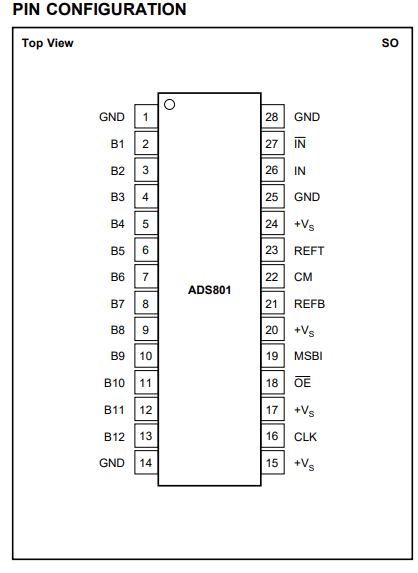
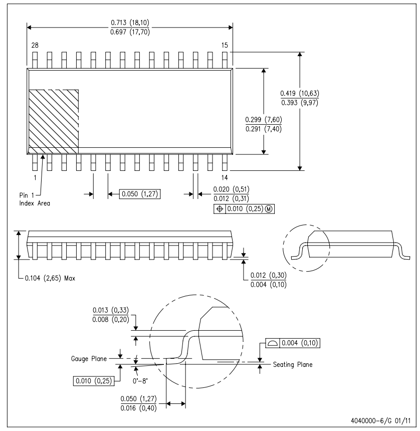
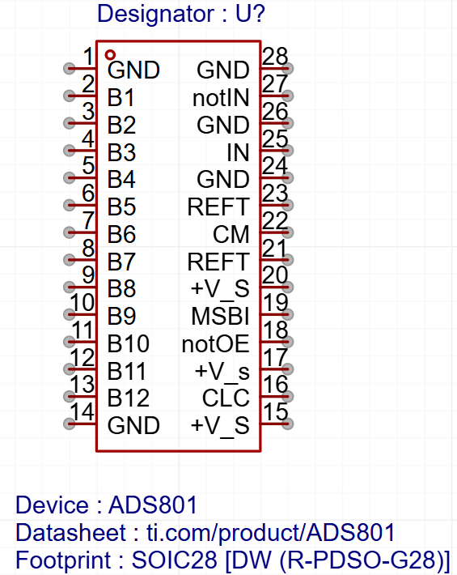
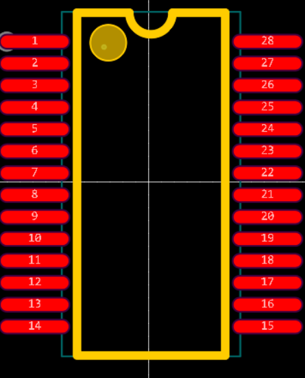

# Самостійна робота № 1

## Завдання:

1. Ознайомитись із технічною документацією 2 на електронний компонент, що
відповідає вашому варіанту завдання (див. табл. СР1.1). Проаналізувати, яке
його призначення та яку функцію він виконує. Зверніть увагу, що у деякій
технічній документації описуються одразу декілька електронних компонентів.
Вам необхідно використовувати тільки ту інформацію з технічної документації,
яка стосується заданого у вашому варіанті електронного компонента.
2. На основі набутих під час виконання комп’ютерних практикумів знань та
навичок спочатку в Редакторі символів намалювати УГП заданого
електронного компоненту.
3. Далі у Редакторі посадкових місць розробити ПМ електронного компонента.
Зверніть увагу, що один і той самий електронний компонент може випускатись
у різних корпусах. Вам необхідно створити ПМ саме для того типу корпусу,
який вказано у завданні.
4. Насамкінець об’єднати УГП та ПМ для створення завершеного бібліотечного
компонентного модуля.

Варіант 3

| No вар. | Назва мікросхеми | Тип корпусу                 | Виробник          | Посилання на інтернет-сторінку із описом мікросхеми або безпосередньо на технічну документацію |
|---------|------------------|-----------------------------|-------------------|------------------------------------------------------------------------------------------------|
| 3       | ADS801           | SOIC28  [DW (R- PDSO- G28)] | Texas Instruments | https://www.ti.com/product/ADS801                                                              |

## Хід роботи

1. Аналіз документації

| |  |
|---|---| 

2. Створення компоненту

[Компонент ADS801 для ProEasyEDA](ADS801.elibz)

| |  |
|---|---| 

*На посадочному місці збільшено ширину контактів для зручної пайки паяльником.

## Висновок

У процесі виконання самостійної роботи було проаналізовано технічну документацію на електронний компонент ADS801, який є високошвидкісним 12-бітовим аналого-цифровим перетворювачем (ADC) з інтерфейсом паралельного типу. Компонент має корпус типу SOIC28, що забезпечує компактність та зручність монтажу.

На основі аналізу технічної документації та отриманих знань під час комп’ютерних практикумів було виконано наступні етапи:

1. **Розробка УГП (умовно-графічного позначення)**: створено точне і зрозуміле графічне представлення електронного компонента в редакторі символів.  
2. **Розробка ПМ (посадкового місця)**: визначено та відтворено всі параметри корпусу SOIC28 відповідно до технічних вимог
3. **Об’єднання УГП та ПМ**: створено завершений бібліотечний модуль компонента ADS801, готовий до використання у проєктуванні електронних схем у середовищі ProEasyEDA.

Результатом виконання завдання є повноцінна бібліотека для використання компонента ADS801 у проєктуванні друкованих плат, що відповідає вимогам технічної документації.