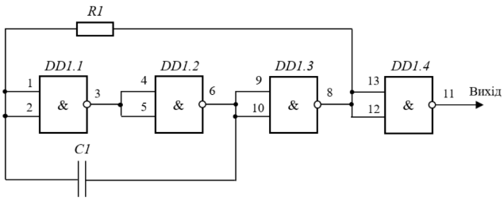
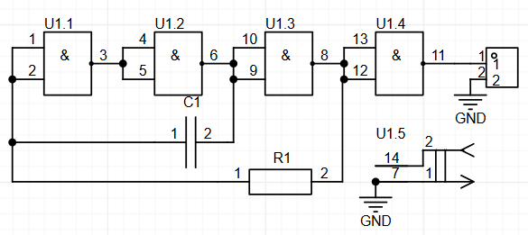
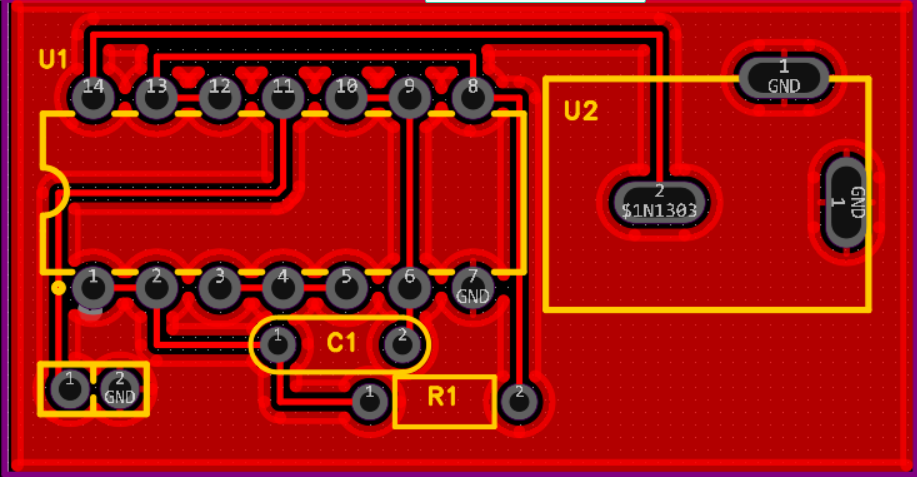

# Самостійна робота № 2

## Завдання:

1. Ознайомитись із принциповою схемою генератора тактових імпульсів згідно
заданого варіанту завдання.
2. Розробити УГП кожного електронного компонента, що використовується в
схемі, та додати до власної бібліотеки (усі геометричні розміри УГП мають
відповідати стандартам). Зверніть увагу, що більшість компонентів вже були
створені на попередніх комп’ютерних практикумах. Створити потрібно тільки
ті, яких немає у бібліотеці.
3. Якщо у схемі передбачене використання пасивних компонентів, то необхідно
пам’ятати, що у ваших бібліотеках є резистори та конденсатори, що мають різні
ПМ (як для монтажу в отвори, так і для поверхневого монтажу). У кожному
варіанті вказано, в якому саме корпусі необхідно використовувати ці електронні
компоненти (а це безпосередньо впливатиме на те, яке ПМ буде використане).
4. У кожному варіанті також вказано тип корпусу мікросхеми. ПМ потрібно
розробляти конкретно під заданий тип корпусу (зокрема, корпуси DIP, SOIC або
SOP4
). Це необхідно враховувати під час роботи із технічною документацією
(datasheet) на мікросхему, оскільки в документації може бути вказано декілька
різних видів ПМ. Розроблене ПМ необхідно зберегти у власну бібліотеку і
об’єднати із УГП мікросхеми.
5. Створити новий проєкт, до якого додати аркуші принципової схеми та
друкованої плати.
6. У редакторі Schematic намалювати задану принципову схему. Для створення
схеми використовувати тільки компоненти із власної бібліотеки.
Використовувані типи роз’ємів, мікросхеми та номінали електронних
компонентів вказані у кожному варіанті.
7. У редакторі PCB Editor розробити друковану плату на основі створеної
принципової схеми. Геометричні розміри плати підібрати таким чином, щоб усі
електронні компоненти компактно розміщувались на ній. Виконати трасування

Варіант 7

Мікросхема DD1 – SN7400 (у корпусі SOP).
Резистор для поверхневого монтажу R1 = 1 кОм.
Конденсатор керамічний для монтажу в отвори С1 = 470 нФ.
Роз’єм живлення – DS-210, роз’єм для виведення сигналу (на виході) – PLS-2.

## Хід роботи

Створення схеми

[Файл](CR2.epro)