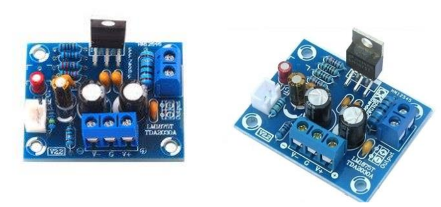
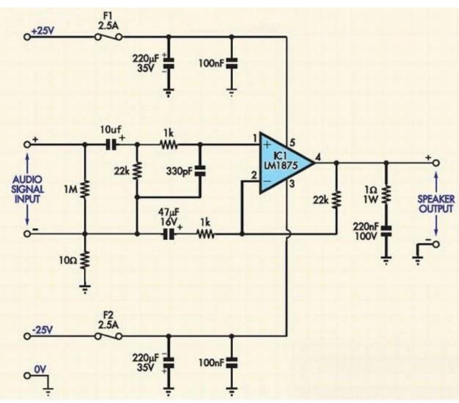
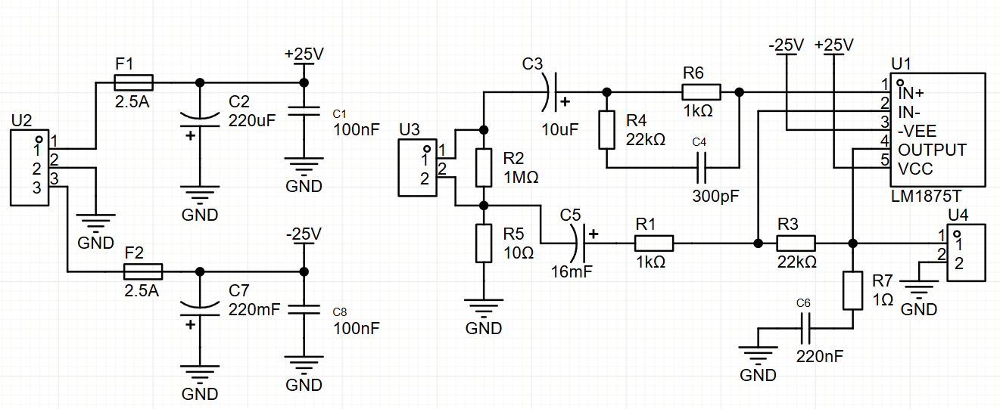
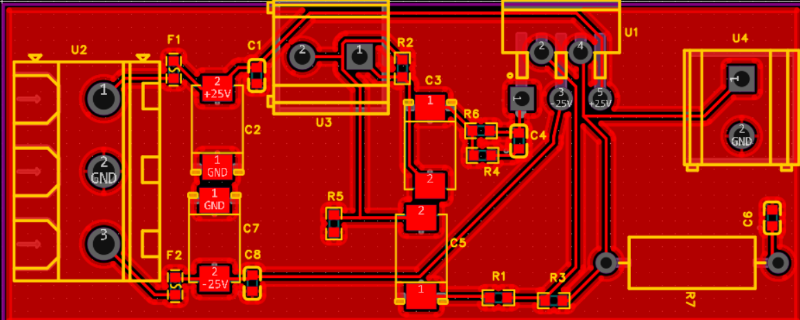

# Самостійна робота № 2

## Завдання:
1. Ознайомитись із варіантом завдання.
2. Намалювати УГП кожного електронного компонента, що використовується в
схемі, та додати до власної бібліотеки. Зверніть увагу, що багато УГП різних
компонентів вже були створені на попередніх комп’ютерних практикумах.
Розробити потрібно тільки ті, яких немає у бібліотеці.
3. Створити для нових електронних компонентів ПМ (тільки у випадку, якщо такі
не були створені раніше на комп’ютерних практикумах) та зберегти їх у власну
бібліотеку. Зазвичай на попередніх комп’ютерних практикумах не були
розроблені використовувані у цій роботі мікросхеми, тому необхідно
самостійно в інтернеті знайти технічну документацію (datasheet) на них. На
основі цієї технічної документації визначити тип корпусу мікросхеми та
геометричні розміри ПМ.
4. Об’єднати відповідні УГП та ПМ для створення завершених бібліотечних
компонентних модулів. Для нових компонентів знайти або створити самостійно
тривимірні моделі корпусів, після чого додати їх до відповідних ПМ.
5. Створити в Altium Designer принципову схему згідно отриманого варіанту
завдання. Використовувати необхідно мікросхеми та номінали електронних
компонентів, що вказані на принципових схемах. Зверніть увагу, що на самих
принципових схемах роз’єми здебільшого не вказуються, проте ви можете
зрозуміти, які роз’єми використовувати за фотографією самої плати. Якщо на
фото плати немає роз’ємів, а є тільки отвори для припаювання провідників, то
ви можете це так і залишити або обрати будь-який відповідний роз’єм для
використання. Ще один нюанс, який необхідно враховувати: у деяких схемах
на виході показано динамік. Зазвичай динамік повинен підключатись через
роз’єми і він не є частиною плати, тож на схемі можете динамік не малювати, а
завершити схему відповідним роз’ємом замість динаміка.
6. Розробити друковану плату на основі створеної принципової схеми. Виконати
трасування плати (або у ручному режимі, або в автоматичному) та пошук
помилок. Важливою вимогою є усунення усіх наявних помилок, щоб у
результаті перевірки не знаходилось жодної помилки.
7. Фотографія плати використовується для прикладу1

, щоб ви розуміли, яким
може бути кінцевий результат. Це не означає, що ваша плата має бути один в
один такою, як на фото, проте вона повинна бути якомога більше схожою на
неї. Тобто, корпуси електронних компонентів бажано використовувати такі, які
зображені на фото.
8. Виконати аналіз плати у 3D режимі та порівняти результат із фотографією
плати, що була дана у завданні.

Основна мікросхема – LM1875T

## Хід роботи

[Документ](AudioPower.epro)